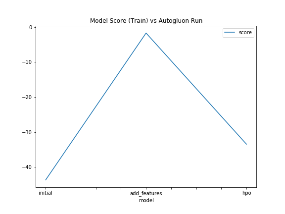
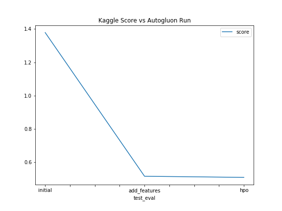

# Report: Predict Bike Sharing Demand with AutoGluon Solution
#### Nathan Rasmussen

## Initial Training
### What did you realize when you tried to submit your predictions? What changes were needed to the output of the predictor to submit your results?
I did not have any issues with my submission initially. I did not have any negative predictions, so I did not need to force them to zero.

### What was the top ranked model that performed?
The initial submission, random forest (specifically `RandomForestMSE_BAG_L1`) as the top performing model. The submission with added features had KNN (specifically `KNeighborsDist_BAG_L1`) as the top performing model when I looked at the ranking from the leaderboard using

```python
predictor.leaderboard(train, extra_info=True, silent=True)
```
For the run using tuned hyperparameters, LGBM was the top performing model (specifically `LightGBM_BAG_L2/T2`).

## Exploratory data analysis and feature creation
### What did the exploratory analysis find and how did you add additional features?

Despite the notebook giving a hint that the timestamp could be feature engineered to give hours, days, or months, this seemed obvious due to the nature of the data. For bike sharing, days of the week such as weekdays matter quite a bit, as do hours of the day. We would naturally expect more demand at noon on Saturday compared to midnight on Sunday.

Another improvement was to make sure numerical data that was not continuous could be treated as categorical. `season` and `weather` are represented numerically, but these are actually categorical by nature. Casting the feature types to `category` helps the model performance improve.

### How much better did your model preform after adding additional features and why do you think that is?
The score improved significantly using data with added features. The model score went from -43.634 to -1.715, and the kaggle score went from 1.38 to 0.56. Since autogluon uses higher scores as better, and kaggle does not, in both cases the score improved. As mentioned above, casting pseudo-numerical data as categorical improves the model, as well as getting added signal from hours/days/months improve the model performance which was expected.

## Hyper parameter tuning
### How much better did your model preform after trying different hyper parameters?
Since a KNN model was the top performing model after adding features, tuning hyperparameters did not improve performance since according to the autogluon documentation, tuning KNN hyperparameters was disabled. After an attempt to add KNN hyperparameter turning to the next run, autoglon skipped KNN. When I removed the KNN hyperparameters, KNN was also skipped since autoglon says it will not run models that do not have hyperparameters provided, and it seemed like it did not use the default values and instead skipped running the KNN models.

This means that the model performance dropped according to the model score in autogluon. Despite this, the model performance did slightly increase for the kaggle score. Since the kaggle dataset does not provide ground truth for the target, the kaggle score reflects the model performance on the test set which is more meaningful than the model performance on the training set.

### If you were given more time with this dataset, where do you think you would spend more time?
I would focus on tuning hyperparameters for models outside of using autogluon. I believe autogluon can be a good first step to finding useful models, but the higher performing models should be tuned outside of autogluon to have more transparency on how to improve the model(s). More feature engineering or scaling could be done as well.

### Create a table with the models you ran, the hyperparameters modified, and the kaggle score.

Reporting hyperparameters is difficult due to how autogluon will try to optimize them. Also, the highest performing models will change due to hyperparameter tuning so getting exact values is not meaningful to compare. For instance, if I am comparing two autogluon runs where one has a LGBM model as the best model, and the other a KNN...which hyperparameters do I compare? I could compare how the individual models performed, like comparing LGBM models for each run. But that won't relate to the scores provided. Again, the next steps for this project would be to not use autogluon and tune hyperparameters for specific models, or use autogluon but limit the model selection to only the few top performing models. That being said, it seems more meaningful to mention the hyperparameter values I have given autogluon and how those compare to the kaggle scores.

|model|hpo1|hpo2|hpo3|score|
|--|--|--|--|--|
|initial|default values|default values|default values|1.37882|
|add_features|default values|default values|default values|0.51509|
|hpo|NN 'num_epochs': 10, 'learning_rate': ag.space.Real(1e-4, 1e-2, default=5e-4, log=True), 'activation': ag.space.Categorical('relu', 'softrelu', 'tanh'), 'layers': ag.space.Categorical([100], [1000], [200, 100], [300, 200, 100]), 'dropout_prob': ag.space.Real(0.0, 0.5, default=0.1)|GBM 'num_boost_round': 100, 'num_leaves': ag.space.Int(lower=26, upper=66, default=36)|default vals|0.50827|

### Create a line plot showing the top model score for the three (or more) training runs during the project.

#### Model train score



#### Model validation score


### Create a line plot showing the top kaggle score for the three (or more) prediction submissions during the project.



## Summary
Autogluon is a useful yet opaque tool to use for training models. I typically would rather focus on knowing the dataset and finding models that I believe would work well with the data, then comparing and tuning them individually...but I can see how it is effective to run autogluon to let the package do the work for me. I can see it being useful to run it over night, giving it a lot more time to determine the best hyperparameters and models to use. I know some things like gridsearch can take a long time and I imagine autogluon does a lot of different steps to get the results we see after training.

Overall I am not a huge fan of it since I found the documentation to be difficult to determine simple things like what exactly are the hyperparameters for each model. I eventually found out most of what I needed to know, but it was dense and not very intuitive. Still, it's a very cool method for doing autoML and I will explore it in other settings to see if I can derive more use out of it.
